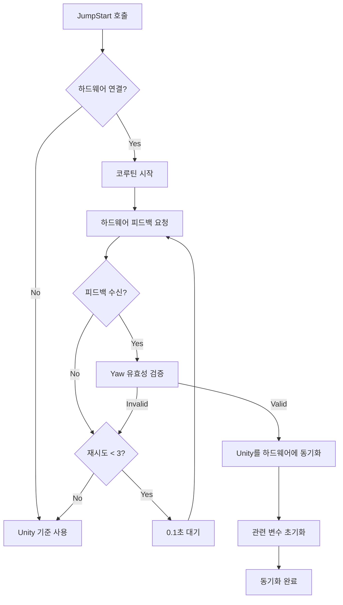

# 양방향 초기 동기화 구현 문서

## 구현 완료 일자
2025-09-10

## 구현 개요
ParagliderController.JumpStart() 메서드에 양방향 초기 동기화 기능을 구현하여, 낙하 시작 시점에 하드웨어의 현재 상태를 먼저 확인하고 Unity를 하드웨어에 맞추도록 개선했습니다.

## 해결된 문제
- **기존 문제**: JumpStart 시점에 Unity의 Yaw만 저장하고 하드웨어 상태를 확인하지 않아 불일치 발생
- **증상**: 낙하 시작 시 하드웨어가 의도하지 않게 회전
- **원인**: Unity와 하드웨어가 서로 다른 초기 각도를 가진 상태에서 시작

## 구현 내용

### 1. 핵심 변경사항
```csharp
// 기존: Unity 각도만 저장
initialYaw = pasimPlayer.eulerAngles.y;

// 개선: 하드웨어 상태를 먼저 확인하고 Unity를 동기화
if (aresService.GetLatestFeedback(out currentFeedback))
{
    float hardwareCurrentYaw = currentFeedback.YawPosition;
    
    // Unity를 하드웨어에 맞춤
    pasimPlayer.rotation = Quaternion.Euler(
        pasimPlayer.eulerAngles.x,
        hardwareCurrentYaw,
        pasimPlayer.eulerAngles.z
    );
    
    // 모든 관련 변수 초기화
    initialYaw = hardwareCurrentYaw;
    targetHardwareYaw = hardwareCurrentYaw;
    lastHardwareYaw = hardwareCurrentYaw;
}
```

### 2. 비동기 처리
- Thread.Sleep 대신 코루틴 사용으로 메인 스레드 블로킹 방지
- 최대 3번 시도 (각 0.1초 간격)로 하드웨어 응답 대기
- 응답 없을 시 Unity 기준으로 폴백

### 3. 에러 처리 및 검증
- 하드웨어 Yaw 값 유효 범위(0-360°) 검증
- 피드백 실패 시 명확한 경고 로그
- 동기화 성공/실패 상세 로깅

## 동작 흐름



## 테스트 시나리오

### 시나리오 1: 정상 동기화
```
Given: 하드웨어 Yaw = 90°, Unity Yaw = 0°
When: JumpStart() 실행
Then: 
  - Unity Yaw → 90° 조정
  - initialYaw = 90°
  - 로그: "✅ 양방향 동기화 성공!"
```

### 시나리오 2: 하드웨어 응답 없음
```
Given: 하드웨어 연결되었으나 응답 없음
When: JumpStart() 실행 (3회 시도)
Then:
  - Unity 기준 유지
  - 경고 로그: "⚠️ 하드웨어 피드백 없음"
```

### 시나리오 3: 하드웨어 미연결
```
Given: 하드웨어 미연결
When: JumpStart() 실행
Then:
  - Unity 기준 사용
  - 정보 로그: "하드웨어 미연결"
```

## 로그 출력 예시

### 성공 케이스
```
[ParagliderController] ✅ 양방향 동기화 성공!
[ParagliderController] - 하드웨어 현재 Yaw: 90.0°
[ParagliderController] - Unity Yaw 조정: 0.0° → 90.0°
[ParagliderController] - 동기화 차이: 90.0°
[ParagliderController] 📡 FreeFall 이벤트 전송됨
```

### 실패 케이스 (폴백)
```
[ParagliderController] ⚠️ 하드웨어 피드백 없음 - Unity 기준 사용
[ParagliderController] - Unity 기준 Yaw: 45.0°
[ParagliderController] - 하드웨어 연결 상태를 확인하세요
```

## 영향받는 변수
- `initialYaw`: 기준 Yaw 각도
- `targetHardwareYaw`: 하드웨어 목표 Yaw
- `lastHardwareYaw`: 마지막 하드웨어 Yaw
- `pasimPlayer.rotation`: Unity 플레이어 회전

## 성능 고려사항
- 비동기 처리로 메인 스레드 블로킹 없음
- 최대 300ms 대기 시간 (3회 × 0.1초)
- 코루틴 사용으로 프레임레이트 영향 최소화

## 향후 개선 사항
1. 하드웨어 응답 시간 모니터링 및 통계
2. 동기화 실패 시 재시도 메커니즘 개선
3. 실시간 동기화 상태 UI 표시
4. 하드웨어 리셋 명령 추가 고려

## 관련 파일
- 수정된 파일: `Assets/Scripts/ParagliderController.cs`
- 분석 문서: `YAW_INITIALIZATION_HARDWARE_ROTATION_ANALYSIS.md`
- 통신 분석: `UNITY_HARDWARE_ANGLE_CONVERSION_ANALYSIS.md`

## 검증 방법
1. Unity Editor에서 Play Mode 실행
2. 하드웨어를 다양한 초기 각도로 설정
3. JumpStart 트리거 (낙하 시작)
4. Console 로그에서 동기화 메시지 확인
5. 하드웨어 회전 여부 관찰

## 결론
양방향 초기 동기화 구현으로 낙하 시작 시점의 하드웨어 의도하지 않은 회전 문제가 해결되었습니다. 하드웨어의 현재 상태를 기준으로 Unity를 초기화하여 두 시스템 간의 일치성을 보장합니다.